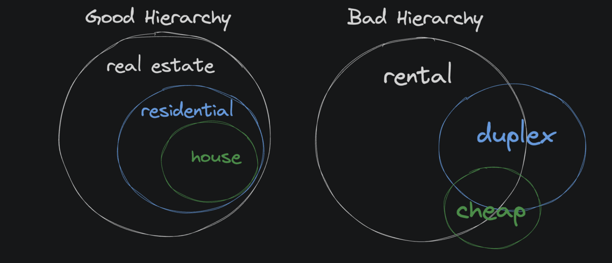
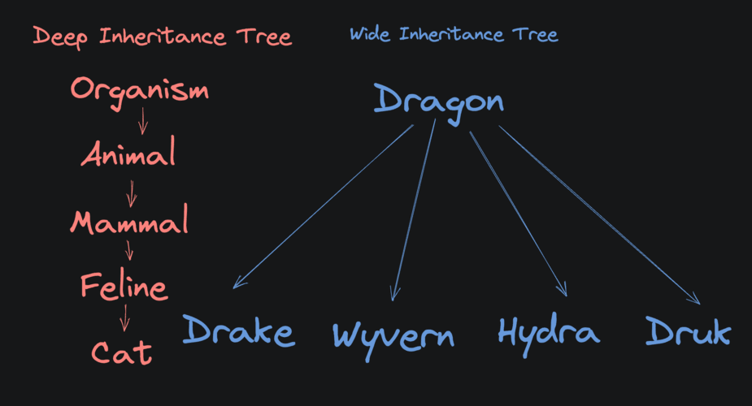

# OOP

## Classes

### Clean Code

- Code that's easy to understand and to work with

#### Clean Code does not :

- Make your programs run faster
- Make your programs function correctly
- Only occur in OOP

#### Clean Code does :

- Make code easier to work with
- Make it easier to find and fix bug
- Make the development process faster
- Help us retain our sanity

### Methods

A method is a function that's tied directly to a class and has access to all its properties.

#### Self

- The first parameter of a method is always the instance of the class that the method is being called on
- By convention, it's called "self". Because `self` is a reference to the object

```py
class Soldier:
    health = 5

    def take_damage(self, damage):
        self.health -= damage
```

### Constructors (initializers)

`__init__` is the constructor and is called when a new object is created

```py
class Soldier:
    def __init__(self):
        self.name = "Legolas"
        self.armor = 2
        self.num_weapons = 2
```

## Encapsulation

**Encapsulation** is the practice of **hiding complexity** inside a "black box" so that it's easier to focus on the problem at hand.

- The most basic example of encapsulation is a **function**
- The **caller** of a function _doesn't need to worry too much about what happens inside_, they just need to understand the _inputs_ and _outputs_

```py
acceleration = calc_acceleration(initial_speed, final_speed, time)
```

- To use the `calc_acceleration` function, we don't need to think about every individual line of code inside the function.
- We just need to know that if we give it the inputs :
  - initial_speed
  - final_speed
  - time
- Then it will give us the correct `acceleration` as an output

### Public and Private

- By default, all properties and methods in a class are _public_
- _Private_ data members are how we encapsulate logic and data within a class.
- To make a property or method _private_, we prefix it with **two underscores**

```py
class Wall:
    def __init__(self, armor, magic_resistance):
        self.__armor = armor
        self.__magic_resistance = magic_resistance

    def get_defense(self):
        return self.__armor + self.__magic_resistance

front_wall = Wall(10, 20)

# This results in an error
print(front_wall.__armor)

# This works
print(front_wall.get_defense())
# 30
```

- We do this because, in this example, `armor` and `magic_resistance` are implementation details
- After creating a `Wall`, they don't matter anymore

### Not Security

- **Encapsulation is about organization, not security**
- Encapsulation is like folders in an unlocked filing cabinet. They don't stop someone from peeking inside, but they do keep everything tidy and easy to find.

### Encapsluation in Python

- Python is a dynamic language, and that makes it difficult for the interpreter to enforce some of the safeguards that languages like `Go` do.
- That's why **encapsulation** in Python is achieved mostly by _convention_ rather than by _force_.
- There are ways to get around the double underscore rule

## Abstraction

**Abstraction** helps us handle complexity by hiding unnecessary details.

- **Abstraction** is about _reducing complexity_

### Abstraction vs encapsulation

- **Abstraction** is about **creating** a simple interface for complex behavior. _It focuses on what's exposed_
- **Encapsulation** is about **hiding** internal state. _It focuses on tucking implementation details away so no one depends on them_

## Inheritance

**Inheritance** tends to be unique to class-based languages like Python, Java, and Ruby

### What is inheritance ?

**Inheritance** allows one class, the "child" class, to _inherit_ the properties and methods of another class, the "parent" class.

- This feature helps us avoid writing a lot of the same code twice.
- It allows us to DRY up our code.

```py
class Animal:
    # parent "Animal" class

class Cow(Animal):
    # child class "Cow" inherits "Animal"
```

- The `Cow` class can reuse the Animal class's constructor with the `super()` method

```py
class Animal:
    def __init__(self, num_legs):
        self.num_legs = num_legs

class Cow(Animal):
    def __init__(self):
        # call the parent constructor to
        # give the cow some legs
        super().__init__(4)
```

### When should I use inheritance?

- **Inheritance** is a powerful tool, but it is a really bad idea to try to overuse it
- Inheritance should only be used when all instances of a child class are also instances of the parent class
- When a child class inherits from a parent, it inherits everything
- If you only want to share some functionality, inheritance is probably not the best answer
- Better to simply share some functions, or maybe make a new parent class that both classes can inherit from

### Inheritance Hierarchy

- A good child class is a strict _subset_ of its parent class.
- An example of this with **private** properties. _A child class cannot simply access a private property of its parent class_. It has to use a **getter**

```py
class Wall:
    def __init__(self, height):
        self.__height = height

    def get_height(self):
        return self.__height

class Castle(Wall):
    def __init__(self, height, towers):
        super().__init__(height)
        self.towers = towers

    def get_tower_height(self):
        return self.get_height() * 2
```



### Multiple children

It is more common for an inheritance tree to be **wide** than deep.



#### Why are inheritance trees often wide instead of deep?

- In good software, a child class is a strict subset of its parent class
- In a deep tree, that means the children need to be perfect members of all the parent class "types"
- That simply doesn't happen very often in the real world
- It's much more likely that you'll have a base class that simply has many sibling classes that are slightly different variations of the base.

## Polymorphism

Polymorphism is the ability of a variable, function or object to take on multiple forms.

- "poly"="many"
- "morph"="form".

```py
class Creature():
    def move(self):
        print("the creature moves")

class Dragon(Creature):
    def move(self):
        print("the dragon flies")

class Kraken(Creature):
    def move(self):
        print("the kraken swims")

for creature in [Creature(), Dragon(), Kraken()]:
    creature.move()
# prints:
# the creature moves
# the dragon flies
# the kraken swims
```

- Polymorphism in programming is the ability to present the same interface (function or method signatures) for many different underlying forms (data types)
- It hides the complexities of the difference behind a clean abstraction

```py
shapes = [Circle(5, 5, 10), Rectangle(1, 3, 5, 6)]
for shape in shapes:
    print(shape.draw_shape())
```

- This is in contrast to the functional way of doing things where you would have had separate functions that have different function signatures, like `draw_rectangle(x1, y1, x2, y2)` and `draw_circle(x, y, radius)`
- Calling two methods with the same signature should look the same to the caller

```py
# same inputs (none)
# same name
# same outputs (a single integer)
health = sam.hit_by_fire()
health = archer.hit_by_fire()
```

### When overriding methods, use the same function signature

The whole point of overriding a method is so that the caller of your code doesn't have to worry about what different things are going on inside the methods of different object types.

### Operator Overloading

Operator overloading is the practice of defining custom behavior for standard Python operators.

| Operation           | Operator | Method           |
| ------------------- | -------- | ---------------- |
| Addition            | +        | \_\_add\_\_      |
| Subtraction         | -        | \_\_sub\_\_      |
| Multiplication      | \*       | \_\_mul\_\_      |
| Power               | \*\*     | \_\_pow\_\_      |
| Division            | /        | \_\_truediv\_\_  |
| Floor Division      | //       | \_\_floordiv\_\_ |
| Remainder (modulo)  | %        | \_\_mod\_\_      |
| Bitwise Left Shift  | <<       | \_\_lshift\_\_   |
| Bitwise Right Shift | >>       | \_\_rshift\_\_   |
| Bitwise AND         | &        | \_\_and\_\_      |
| Bitwise OR          | \|       | \_\_or\_\_       |
| Bitwise XOR         | ^        | \_\_xor\_\_      |
| Bitwise NOT         | ~        | \_\_invert\_\_   |
