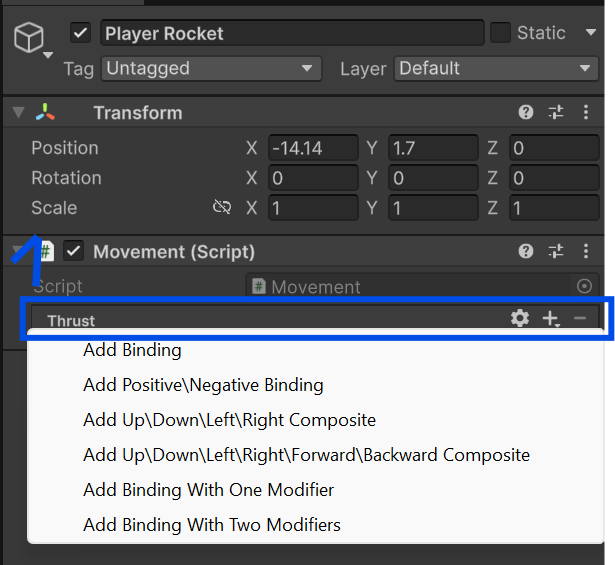

# Recipes

## Cinemachine

The Cinemachine component is used to create a camera that follows the player.

- Cinemachine needs to be installed from the Unity Package Manager
- Window > Package Manager > Unity Registry > Search for "Cinemachine" > Install
- Add a Cinemachine Camera to the scene (Right click in the hierarchy > Cinemachine > Cinemachine Camera)
- In the Inspector panel, Tracking Target > Select the player
- In the Global Settings, set the Position Control and the Rotation Control to "Follow"

## Simplest Input System

1. Use the `UnityEngine.InputSystem` namespace
2. Create `InputAction` *variables* (that are serialized)
3. Add *bindings* for each `InputAction`
4. *Enable* each `InputAction`
5. Use the *value* of the `InputAction` for gameplay
6. *Disable* each `InputAction` if/when we need to turn off input


### Step 1 & 2
::: code-group

```cs:line-numbers [Movement.cs]
using UnityEngine;
using UnityEngine.InputSystem; // [!code ++]

public class Movement : MonoBehaviour
{
    [SerializeField] InputAction thrust; // [!code ++]

    // OnEnable is an event called when the object becomes enabled and active
    // OnEnable is called before Start
    private void OnEnable() // [!code ++]
    { // [!code ++]
        thrust.Enable(); // [!code ++]
    } // [!code ++]
}

```

:::

### Step 3
- In the Editor
- Select the object with the script (Movement.cs)



- Click on `+` => Add Binding => double click on `<No Binding>` => Path - Select the binding wanted

## Set world gravity
- example use case : moon gravity

Edit => Project Settings => Physics => Settings
Shared: Change gravity (ex: moon like gravity - `Y: -4`)