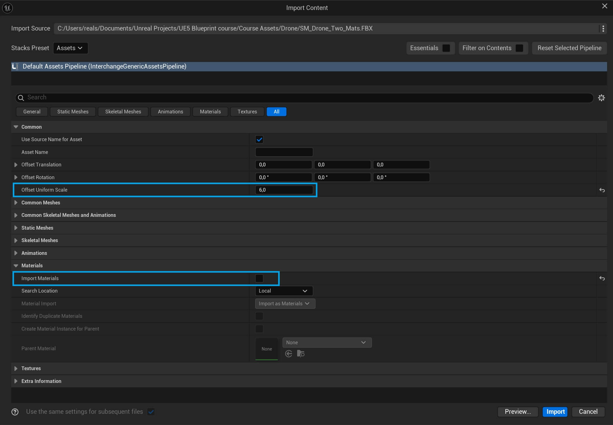

# Unreal tips

## Importing assets and performance

- When importing `.fbx` assets, we can add initial scaling
- It can help avoid performance issue if we manually set scaling directly on each object
- If a material already exist, we can uncheck the box
- It will be converted into `.uassaet` file

